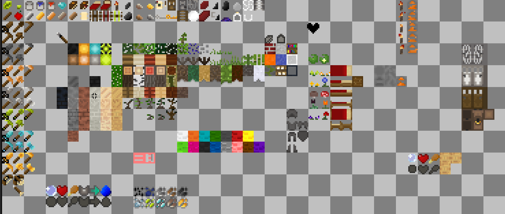

# MiniPixels
> 8x8 Texture pack, made out of my free time and how i wanted the game to look like, its not complete yet and MTG is still in progress to be completely supported, but its already quite playable it uses some palettes of Pixel Perfection and core MTG alike, but the textures are made by me
## What's planned?
- Its planned to support MTG game completely, plus just as Pixel Perfection XT support most used mods that u can find on contentDB

Note: Some of the textures on this image havent been renamed and added, but this is the current state of the pack
### Which mods?
- MTG (WIP)
- 3d_armor (WIP)
> I might just use XT armors and just do INV textures
- Stamina (Complete i think)
- Thirsty (WIP)
- More Ores (WIP)
- Spears
- Few more mods i use
#### This texture pack is licenced under CC-BY-SA-4.0
